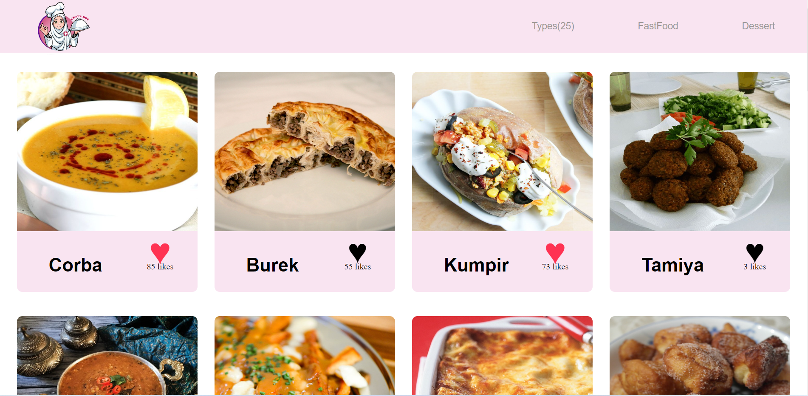

# JavaScript-capstone-project
this is a webpack project that the purpose of this project is to understand how use JavaScript to make websites dynamic and build basic single page apps,use ES6 syntax,use ES6 modules,use callbacks and promises,use webpack,apply JavaScript best practices and language style guides in code,use AAA pattern for unit tests,write units tests for a JavaScript appfollow Gitflow,solve simple git conflicts,send and receive data from an API,use API documentation,nderstand and use JSON,make JavaScript code asynchronous,perform a code review for a team member.

# Built With
- HTML
- CSS
- JavaScripth
- Webpack

# Getting Started
  Follow the instructions below to get started.
- Cloning the repo
- cd into the directory
- installing the npm packages (npm install)
- And finally starting the app. (that will be npm start) 

# Video Link :)

[Video Link](https://www.loom.com/share/8e56755bcdd04a5cb4874bf0eaa3c612)

# Live Demo :)

[Live Demo Link](https://saeqasultani.github.io/JavaScript-capstone-project/)

# Authors

👤 Saeqa Sultani

GitHub: [SaeqaSultani](https://github.com/SaeqaSultani)

Twitter: [SaeqaSultani](https://twitter.com/SaeqaSultani)

LinkedIn: [SaeqaSultani](https://www.linkedin.com/in/saeqa-sultani-b41493187/)

# 🤝 Contributing
Contributions, issues, and feature requests are welcome!

Feel free to check the [issues page](https://github.com/SaeqaSultani/JavaScript-capstone-project/issues).

# Show your support
Give a ⭐️ if you like this project!

# Acknowledgments
- Hat tip to anyone whose code was used
- Inspiration
- etc
# 📝 License
This project is [MIT](https://github.com/SaeqaSultani/Leaderboard/blob/stup/MIT.md) licensed.